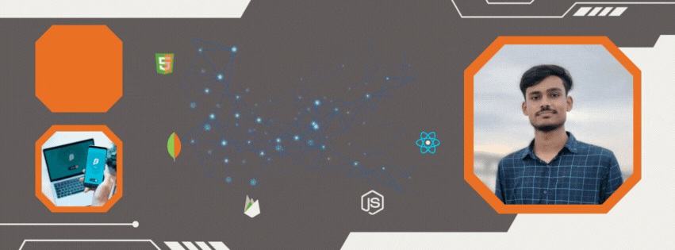

<h2 align="center">
  
</h2>

 

# 👨‍💻 About Me  
 

  I'm a passionate <strong>MERN Stack Developer</strong> and <strong>Competitive Programmer</strong> who loves building modern web applications and solving algorithmic problems.  
  I enjoy working with JavaScript technologies, creating scalable backend systems, and crafting clean UI experiences.

 

  <h3>🙋🏻 Profile Overview</h3>
  
<strong>Currently Working On:</strong> Full-Stack MERN Projects

  
<strong>Learning:</strong> Advanced MERN Stack, DSA, Competitive Programming

  
<strong>Interests:</strong> Web Development, Problem Solving, Open Source

  
<strong>Looking To Collaborate:</strong> MERN, React Projects, API Development

  
<strong>Reach Me At:</strong> mdrakibislam.kcn@gmail.com

 

  

  

  

  

  

  
  

 

# ⚒️ Languages & Tools ⚒️
 

  
  

 

  

# 📊 GitHub Stats
 

  
  

 

  

 

# 🏆 GitHub Trophies
 

  

 

# 📅 GitHub Contribution Calendar
 

  

